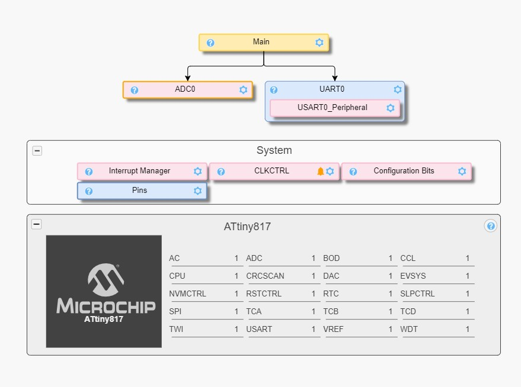
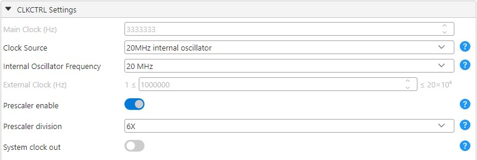
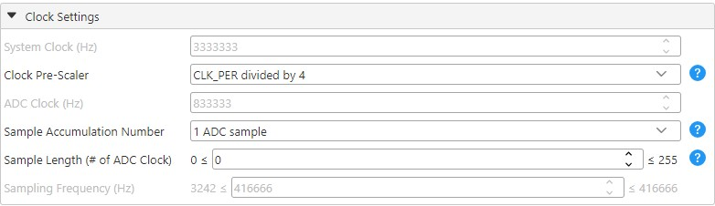
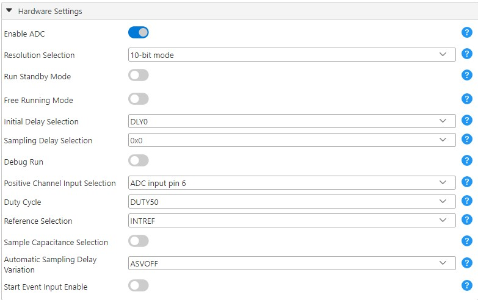
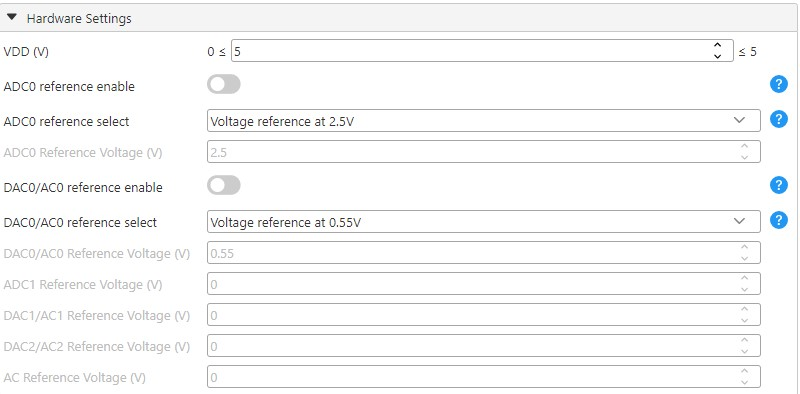
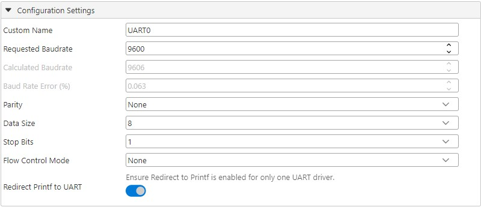
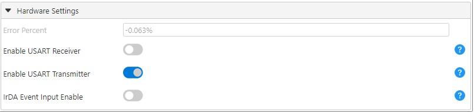
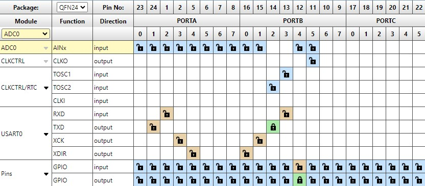

<!-- Please do not change this logo with link -->

<a target="_blank" href="https://www.microchip.com/" id="top-of-page">
   <picture>
      <source media="(prefers-color-scheme: light)" srcset="images/mchp_logo_light.png" width="350">
      <source media="(prefers-color-scheme: dark)" srcset="images/mchp_logo_dark.png" width="350">
      
   </picture>
</a>

# ADC Basics With tinyAVR® 0- and 1-series, and megaAVR® 0-series

Microchip tinyAVR® 0- and 1-series, and megaAVR® 0-series devices feature a 10-bit successive approximation register (SAR) Analog-to-Digital Converter (ADC) and are capable of conversion rates up to 115 ksps. It features a flexible multiplexer, which allows the ADC to measure the voltage at multiple single-ended input pins. Single-ended input channels are referred to ground. The ADC input signal is fed through a sample-and-hold circuit which ensures that the input voltage to the ADC is held at a constant level during sampling. It also features multiple internal ADC reference voltages between 0.55V and VDD.

An ADC conversion can be started by software, or by using the Event System (EVSYS) to route an event from other peripherals. A window compare feature is available for monitoring the input signal and can be configured to trigger an interrupt on user-defined thresholds for under, over, inside, or outside a window, with minimum software intervention required.

This repository describes the basic functionality of the ADC in Microchip tinyAVR® 0- and 1-series, and megaAVR® 0-series devices in Single-Ended mode. It is explained in detail in the document [*AN2573 - ADC Basics with tinyAVR® 0- and 1-series, and megaAVR® 0-series*](https://www.microchip.com/DS00002573) from Microchip. The ATtiny817 Xplained Pro board will be used in these examples.

## Related Documentation
- [AN2573 - ADC Basics with tinyAVR® 0- and 1-series, and megaAVR® 0-series](https://www.microchip.com/DS00002573)
- [ATtiny817 Device Page](https://www.microchip.com/wwwproducts/en/ATtiny817)

## Software Used

- [MPLAB® X IDE v6.20](https://www.microchip.com/en-us/tools-resources/develop/mplab-x-ide) or newer
- [MPLAB® XC8 Compiler v2.50](https://www.microchip.com/en-us/tools-resources/develop/mplab-xc-compilers) or newer
- [MPLAB® Code Configurator (MCC) v5.5.1](https://www.microchip.com/en-us/tools-resources/configure/mplab-code-configurator) or newer

## Hardware Used
- [ATtiny817 Xplained Pro](https://www.microchip.com/DevelopmentTools/ProductDetails/attiny817-xpro)
- Micro-USB cable (Type-A/Micro-B)

## Setup

**Note:** The newest version of the code is generated by MCC instead of START.

### MCC Setup
This section shows how this example is set up in MCC. An overview of the MCC setup is shown in the image below:
<p></p>

### Device Clock Setup
The CLKCTRL module is located in the System Firmware drop-down menu. This example is configured to run on 3.33 MHz.
<p></p>

### ADC Setup
In the Clock Settings of the ADC, the Clock Pre-Scaler is set to CLK_PER divided by 4. This is to ensure that max resolution is achieved with an ADC clock frequency between 50 kHz and 1.5 MHz.
<p></p>

In the Hardware Settings, set the Reference Selection to INTREF. The Positive Channel Input Selection sets the ADC input pin, but the code overwites it. It can be changed on this code line ```#define ADC_CHANNEL 6``` in the ```main.c``` file.
<p></p>

### VREF Setup
The Voltage reference is selected in the V<sub>REF</sub> peripheral. It is set to 2.5V and matches the code line ```#define MAX_VOL 2.5``` in the ```main.c``` file.
<p></p>

### USART Setup

In the USART Configuration Settings, enable Redirect Printf to UART. The rest can be left as default.
<p></p>

In the USART0_Peripheral, the USART Receiver can be disabled, since it is not in use.
<p></p>

### Device Pin Setup
Setting inputs and outputs can be done in the **Pin Grid View** tab. The LED0 pin on the ATtiny817 Xplained Pro is PB4. Set this to be an output, MCC will handle pins used by the USART and ADC peripherals.
<p></p>

Naming and configuring the different pins can be done in the *System>Pins* menu. 
<p></p>

## Operation

1. Connect the ATtiny817 Xplained Pro board to the PC using the USB cable.

2. Download the zip file or clone the example to get the source code.

3. Open the project in MPLAB X IDE.
      
4. Choose the use case by configuring the value of the macro ```EXAMPLE_CODE``` in ```main.c```. Refer to the document [AN2573 - ADC Basics with tinyAVR® 0- and 1-series, and megaAVR® 0-series](https://www.microchip.com/DS00002573) to learn about the different use cases.

5. Build the solution and program the device by using the buttons **Build** and **Make and Program Device**.

6. The ADC result is converted to voltage format and printed through the USART to the terminal.

## Conclusion

This project is an illustration of four basic use cases based around the ADC of Microchip tinyAVR® 0- and 1-series, and megaAVR®  0-series devices.